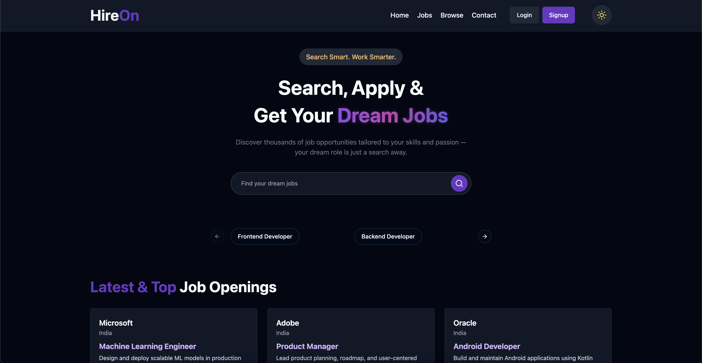

# 💼 HireOn - MERN Stack Job Portal

**HireOn** is a full-stack job portal web application built using the **MERN stack**, designed to connect job seekers and recruiters through a seamless, scalable, and modern platform. It features a clean user interface, real-time communication, secure authentication, and document handling to simulate a real-world hiring ecosystem.



## ✨ Features

- **🌙 Animated Dark/Light Mode** - Smooth theme transitions using Framer Motion
- **🔐 Secure Authentication** - Google OAuth 2.0, JWT tokens, and email verification
- **💬 Real-time Chat** - Instant messaging with Socket.IO for seamless communication
- **🖼️ Profile Management** - Cloudinary-powered image uploads and profile customization
- **📄 Resume Handling** - Google Drive API integration for document management
- **🧑‍💼 Role-based Dashboards** - Tailored experiences for job seekers and recruiters
- **📱 Responsive Design** - Optimized for all devices and screen sizes
- **🛡️ Secure Backend** - Protected routes with comprehensive error handling

## 🛠️ Tech Stack

- **Frontend**: React.js, Redux Toolkit, Tailwind CSS, Framer Motion
- **Backend**: Node.js, Express.js
- **Database**: MongoDB with Mongoose ODM
- **Authentication**: JWT, Google OAuth 2.0, Nodemailer
- **Real-time Communication**: Socket.IO
- **Media & Documents**: Cloudinary, Google Drive API
- **Version Control**: Git & GitHub

## 🚀 Quick Start

### Prerequisites

- Node.js 18+
- MongoDB instance
- Google OAuth 2.0 credentials
- Cloudinary account
- Google Drive API credentials

### Installation

1. **Clone the repository**

   ```bash
   git clone https://github.com/theshibaprasad/HireOn.git
   cd HireOn
   ```

2. **Install backend dependencies**

   ```bash
   cd backend
   npm install
   ```

3. **Install frontend dependencies**

   ```bash
   cd ../frontend
   npm install
   ```

4. **Set up environment variables**

   Create `.env` files in both backend and frontend directories:

   **Backend (.env)**
   ```env
   # MongoDB
   MONGODB_URI=your_mongodb_connection_string
   
   # JWT
   JWT_SECRET=your_jwt_secret_key
   
   # Google OAuth
   GOOGLE_CLIENT_ID=your_google_client_id
   GOOGLE_CLIENT_SECRET=your_google_client_secret
   
   # Email (Nodemailer)
   EMAIL_USER=your_email@gmail.com
   EMAIL_PASS=your_email_app_password
   
   # Cloudinary
   CLOUDINARY_CLOUD_NAME=your_cloudinary_cloud_name
   CLOUDINARY_API_KEY=your_cloudinary_api_key
   CLOUDINARY_API_SECRET=your_cloudinary_api_secret
   
   # Google Drive API
   GOOGLE_DRIVE_CLIENT_ID=your_google_drive_client_id
   GOOGLE_DRIVE_CLIENT_SECRET=your_google_drive_client_secret
   GOOGLE_DRIVE_REDIRECT_URI=your_redirect_uri
   ```

   **Frontend (.env)**
   ```env
   # API Base URL
   VITE_API_BASE_URL=http://localhost:5000/api
   
   # Google OAuth
   VITE_GOOGLE_CLIENT_ID=your_google_client_id
   ```

5. **Set up the database**

   ```bash
   cd backend
   npm run setup-db
   ```

6. **Run the development servers**

   **Backend (Terminal 1)**
   ```bash
   cd backend
   npm run dev
   ```

   **Frontend (Terminal 2)**
   ```bash
   cd frontend
   npm run dev
   ```

7. **Open your browser**

   Navigate to [http://localhost:5173](http://localhost:5173)

## 📁 Project Structure

```text
├── backend/                # Express.js server
│   ├── api/               # API routes
│   ├── auth/              # Authentication middleware
│   ├── controllers/       # Business logic
│   ├── middlewares/       # Custom middleware
│   ├── models/            # MongoDB schemas
│   ├── routes/            # Route definitions
│   └── utils/             # Utility functions
├── frontend/              # React.js application
│   ├── src/
│   │   ├── components/    # Reusable UI components
│   │   │   ├── admin/     # Admin-specific components
│   │   │   ├── auth/      # Authentication components
│   │   │   ├── shared/    # Shared components
│   │   │   └── ui/        # UI components
│   │   ├── hooks/         # Custom React hooks
│   │   ├── redux/         # Redux store and slices
│   │   └── utils/         # Utility functions
│   └── public/            # Static assets
```

## 🎯 Key Features Explained

### Authentication System

- **Google OAuth 2.0**: Secure social login integration
- **JWT Tokens**: Stateless authentication with refresh tokens
- **Email Verification**: Nodemailer-powered verification system
- **Password Recovery**: Secure forgot password flow with token validation

### Real-time Communication

- **Socket.IO Integration**: Instant messaging between users
- **Chat History**: Persistent message storage
- **Online Status**: Real-time user presence indicators
- **Message Notifications**: Instant alerts for new messages

### Document Management

- **Resume Upload**: Google Drive API integration for secure storage
- **Profile Images**: Cloudinary-powered image upload and optimization
- **File Validation**: Secure file type and size validation
- **Document Preview**: Built-in document viewing capabilities

### Role-based Access

- **Job Seeker Dashboard**: Personalized job recommendations and applications
- **Recruiter Dashboard**: Job posting and candidate management tools
- **Admin Panel**: Comprehensive system administration
- **Super Admin**: Advanced user and company management

## 🔧 Database Schema

### Collections

- **Users**: Profile management and authentication data
- **Companies**: Organization information and settings
- **Jobs**: Job postings with detailed requirements
- **Applications**: Job application tracking and status
- **Messages**: Real-time chat message storage
- **Contact Messages**: Support and inquiry management

## 🎨 UI/UX Features

- **Dark/Light Mode**: Animated theme switching with Framer Motion
- **Responsive Design**: Mobile-first approach with Tailwind CSS
- **Smooth Animations**: Engaging micro-interactions and transitions
- **Intuitive Navigation**: User-friendly interface with clear hierarchy
- **Loading States**: Optimistic UI with proper loading indicators

## 🔒 Security & Performance

- **Secure Authentication**: JWT-based stateless authentication
- **Data Privacy**: MongoDB with proper indexing and validation
- **File Security**: Secure file upload with validation and sanitization
- **API Protection**: Rate limiting and input validation
- **Error Handling**: Comprehensive error management and logging

## 🚀 Deployment

### Backend Deployment

1. **Set up environment variables** on your hosting platform
2. **Configure MongoDB** connection string
3. **Set up Google OAuth** credentials
4. **Deploy to your preferred platform** (Heroku, Vercel, etc.)

### Frontend Deployment

1. **Update API base URL** in environment variables
2. **Build the application**: `npm run build`
3. **Deploy to your hosting platform**

## 🤝 Contributing

1. Fork the repository
2. Create your feature branch (`git checkout -b feature/AmazingFeature`)
3. Commit your changes (`git commit -m 'Add some AmazingFeature'`)
4. Push to the branch (`git push origin feature/AmazingFeature`)
5. Open a Pull Request

## 📝 License

This project is licensed under the MIT License - see the [LICENSE](LICENSE) file for details.

## 🙏 Acknowledgments

- [React.js](https://reactjs.org/) for the amazing frontend framework
- [Express.js](https://expressjs.com/) for the robust backend framework
- [MongoDB](https://www.mongodb.com/) for the flexible database
- [Socket.IO](https://socket.io/) for real-time communication
- [Tailwind CSS](https://tailwindcss.com/) for utility-first styling
- [Framer Motion](https://www.framer.com/motion/) for smooth animations
- [Cloudinary](https://cloudinary.com/) for media management
- [Google APIs](https://developers.google.com/) for authentication and storage

## 📞 Contact

**Shiba Prasad Swain** - [LinkedIn](https://www.linkedin.com/in/theshibaprasad/) - theshibaprasad@gmail.com

---

⭐ If you found this project helpful, please give it a star!


